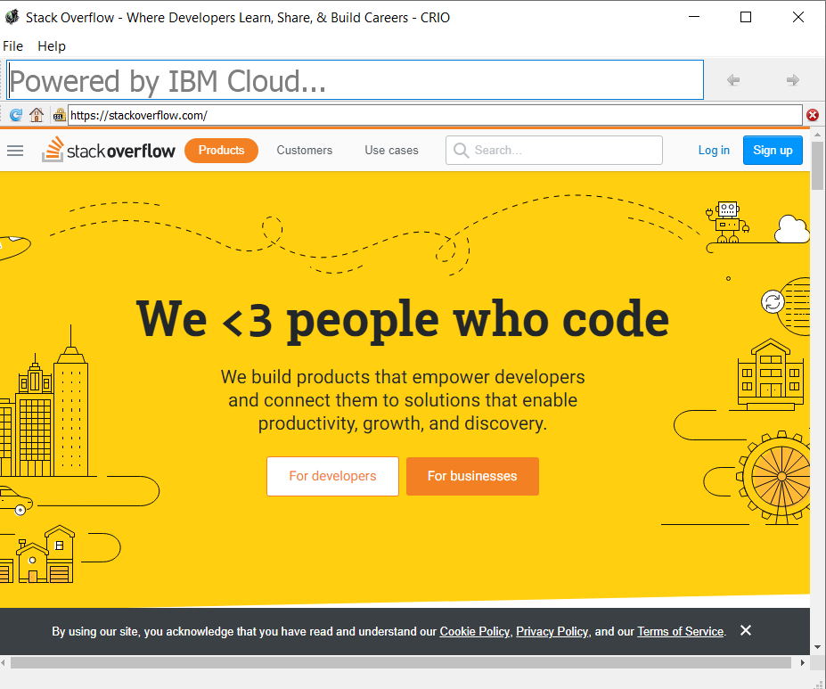
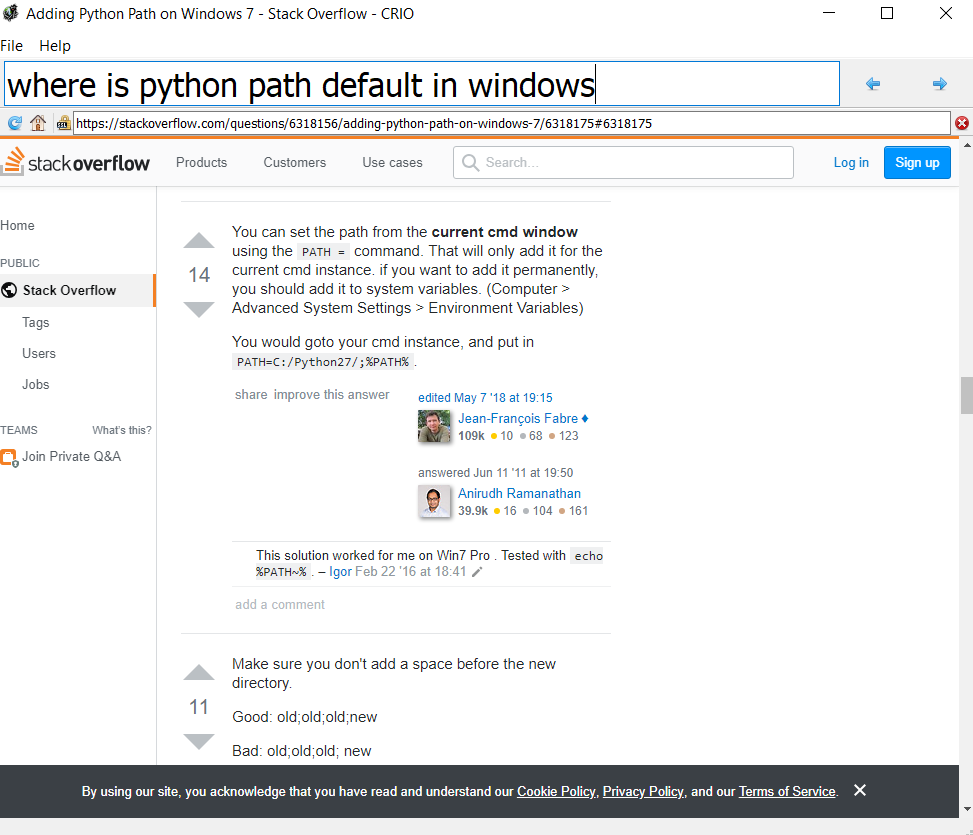
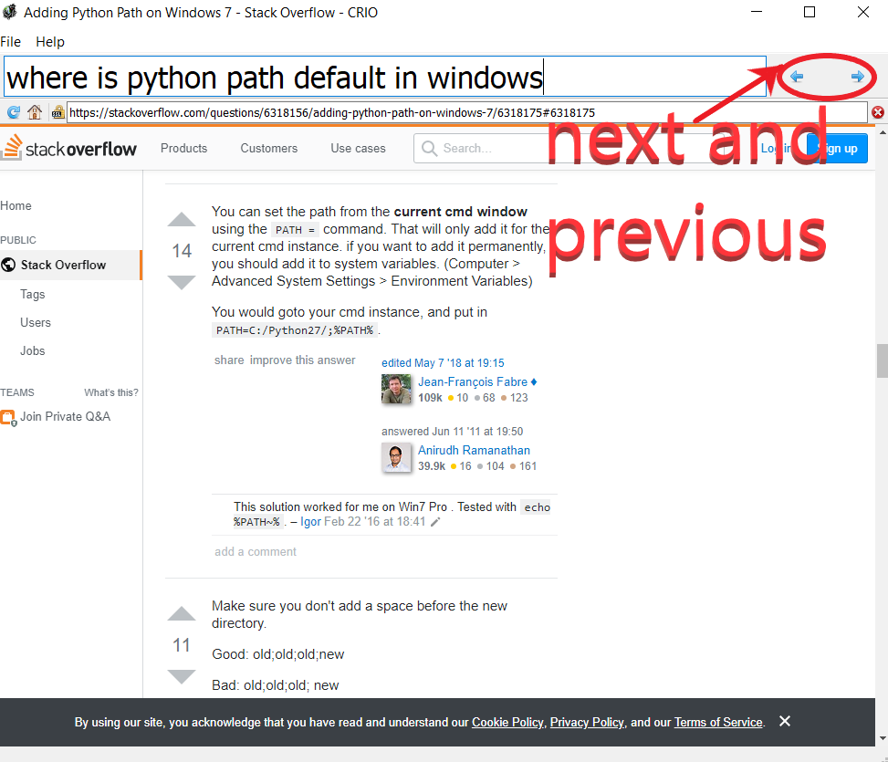
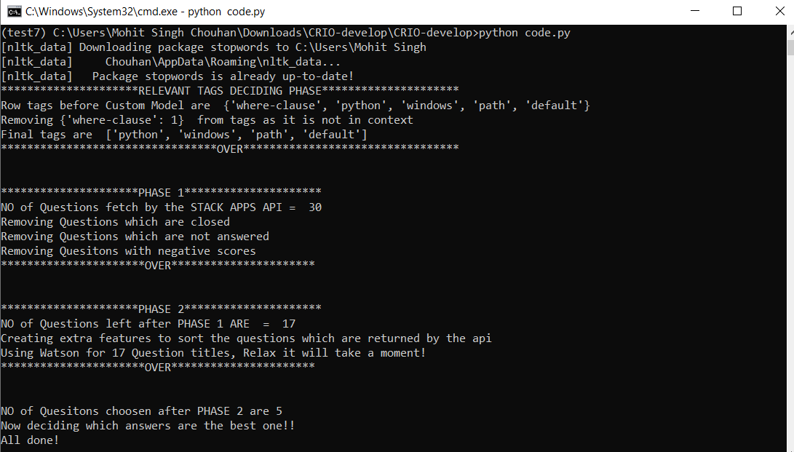
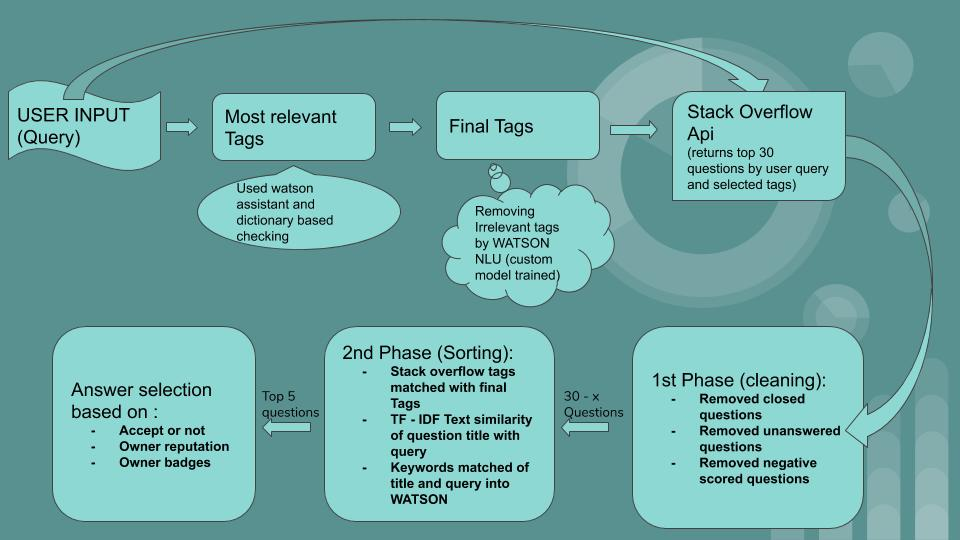

# Programming_Problem_Solver
A PyQT5 desktop Application that analyses user's StackOverflow query and fetches the most relevant answers from the most relevant questions.

# Quick Installation:
Inside the project repositry type: \
`pip install -r requirements.txt` \
Also download Spacy English Model(11mb):\
`python -m spacy download en_core_web_sm`

## Watson Services Used:  
* Watson Knowledge Studio  
* Watson NLU  
* Watson Assistant's Fuzzy Logic and Spell checking.  

## How to run this application:
```python code.py```

You will get a screen like this:



Enter the query on the Text Box where "Powered by Ibm cloud is printed" and WAIT for 1 minute(Aprox) for WATSON,and other task to happen
For Example:



You can see all the top answers by next and previous button provided in the gui:



You can also see the command prompt to see what is happening in the background:




>>> Speciality:  
1). We can clearly see in the 3rd image in ```RELEVANT TAGS DECIDING PHASE``` that where-clause was ```removed``` by our Custom Model trained on IBM WATSON KNOWLEDGE STUDIO to check if a tag is relevant or not.  
2). Best Answers are shown highlighted  first and than next answers can be seen by next arrow.  
3). Complex features are made based on Quesiton title to check the text similarity with the user's query  

## PPT LINK:  
https://drive.google.com/file/d/1wX_WRGH3No4DQZ8CONdEZlwj1qK3flGO/view?usp=sharing

## VIDEO LINK:
https://youtu.be/omWdOuMeS9A

## FLOW DIAGRAM:  

